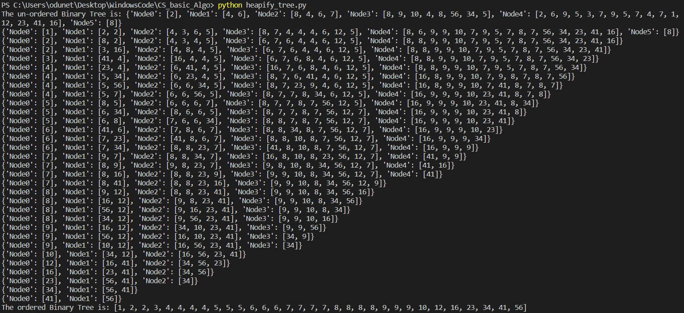

# Basic CS Algorithm

This is a Python implementation for the below listed Search and Sort algorithm:

- Binary Search
- Bubble Sort
- Insertion Sort
- Binary Tree
- Heapify Tree

## Usage

```ssh
# Binary Search
python binary_search.py

# Bubble sort
python bubble_sort.py

# Insertion Sort
python insertion_sort.py

# Build a binary tree
python binary_tree.py

# Quick sort
python quickSort.py

# Merge sort
python mergeSort.py

# Implement Hash table - Chaining
python hashTable.py

# Implement Tries
python triesDatastructure.py
```

## Output

The output is displayed using Python's standard IO and displayed in the command line. The results of the search could also be used outside each module by importing the module and calling function

```python
"""
Sample Codes
"""

# import module, e.g. bubble sort
from bubble_sort import bubble_sort
a = [3,2,1,5,4,6,7,10,11,17,16,15]
#Call function
print( bubble_sort(a) )

# import module, e.g. binary search
from binary_search import binary_search
#Initialize variable
lst = [3,2,1,4,5,6,7,10,11,14,16,17,19,20,23,25,28,30]
missing_num = 19
#Call function
print( binary_search(lst,missing_num) )
'
# import module, e.g. Heapify Sort / Binary Tree
#Initialize test list
s = [2,4,6,8,4,6,7,8,9,10,4,8,56,34,5,2,6,9,5,3,7,9,5,7,4,7,1,12,23,41,16,8]
#Call the function to make a Binary Tree
import math
from binary_tree import binaryT
from heapify tree import heap
tree1 = binaryT(s)
print("The un-ordered Binary Tree is: {}".format(tree1))
#Call the function to Heapify the Binary Tree
HeapifiedTree = heap(tree1)
print("The ordered Binary Tree is: {}".format(HeapifiedTree))
```

```python
#Sample CLI output of heapify_tree.py
```



## License

MIT License

Copyright (c) [2021] [Ayo Odu]

Permission is hereby granted, free of charge, to any person obtaining a copy
of this software and associated documentation files (the "Software"), to deal
in the Software without restriction, including without limitation the rights
to use, copy, modify, merge, publish, distribute, sublicense, and/or sell
copies of the Software, and to permit persons to whom the Software is
furnished to do so, subject to the following conditions:

The above copyright notice and this permission notice shall be included in all
copies or substantial portions of the Software.

THE SOFTWARE IS PROVIDED "AS IS", WITHOUT WARRANTY OF ANY KIND, EXPRESS OR
IMPLIED, INCLUDING BUT NOT LIMITED TO THE WARRANTIES OF MERCHANTABILITY,
FITNESS FOR A PARTICULAR PURPOSE AND NONINFRINGEMENT. IN NO EVENT SHALL THE
AUTHORS OR COPYRIGHT HOLDERS BE LIABLE FOR ANY CLAIM, DAMAGES OR OTHER
LIABILITY, WHETHER IN AN ACTION OF CONTRACT, TORT OR OTHERWISE, ARISING FROM,
OUT OF OR IN CONNECTION WITH THE SOFTWARE OR THE USE OR OTHER DEALINGS IN THE
SOFTWARE.
